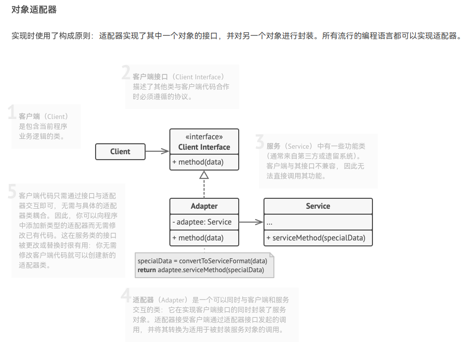
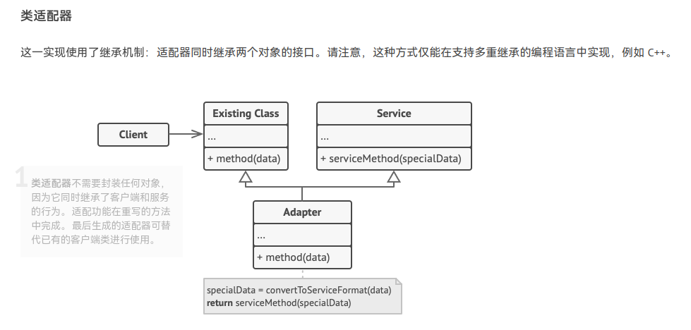

# Adapter 模式

在现实生活中，经常出现两个对象因接口不兼容而不能在一起工作的实例，这时需要第三者进行适配。例如，讲中文的人同讲英文的人对话时需要一个翻译，用直流电的笔记本电脑接交流电源时需要一个电源适配器，用计算机访问照相机的 SD 内存卡时需要一个读卡器等。

 在软件设计中也可能出现：需要开发的具有某种业务功能的组件在现有的组件库中已经存在，但它们与当前系统的接口规范不兼容，如果重新开发这些组件成本又很高，这时用适配器模式能很好地解决这些问题。

适配器模式的优缺点如下：

- 优点：
  1. 单一职责原则：你可以将接口或数据转换代码从程序主要业务逻辑中分离；
  2. 开闭原则：只要客户端代码通过客户端接口与适配器进行交互，你就能在不修改现有客户端代码的情况下在程序中添加新类型的适配器；
- 缺点：代码整体复杂度增加，因为你需要新增一系列接口和类。有时直接更改服务类使其与其他代码兼容会更简单。

适配器模式的结构有以下两种：

# 实战

MAC 笔记本使用的是 Lightning port，而 Windows 笔记本使用的是 USB port。现在我希望把 MAC 笔记本的数据传输到 Windows 笔记本（adaptee object）中，但我没办法直接转换，我们需要一个适配器。

我们创建一个`adapter`结构体，它有以下功能：

- 遵循符合客户端期望的相同接口（Lighting port）；
- 可以适合 adaptee object 对来自客户端的请求进行“翻译”。Adapter能够接受来自 Lighting port 的信息，并转换为 USB 格式的信号，同时把这些信号传递给 Windows 笔记本的 USB port。

# 参考资料

- [适配器模式-Wikipedia](https://zh.wikipedia.org/zh-cn/%E9%80%82%E9%85%8D%E5%99%A8%E6%A8%A1%E5%BC%8F)
- [lpxxn的示例代码](https://github.com/lpxxn/rust-design-pattern/blob/master/structural/adapter.rs)
- [yukihir0的示例代码](https://github.com/yukihir0/rust_design_pattern/blob/master/adapter/src/main.rs)
- [适配器模式](https://refactoringguru.cn/design-patterns/adapter)

---
